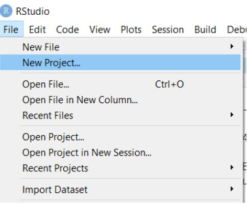
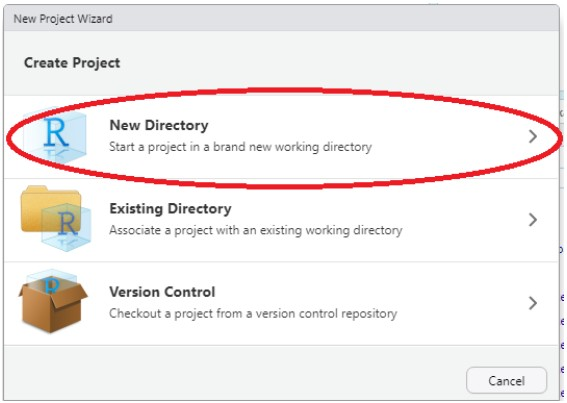
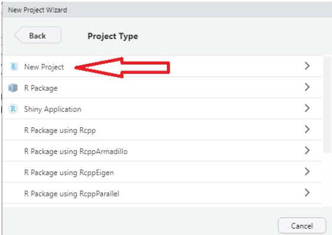
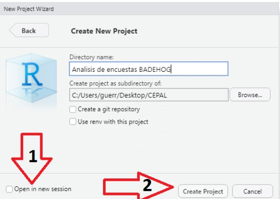

```{r setup, include=FALSE}
# Configuración inicial: No mostrar mensajes ni warnings
knitr::opts_chunk$set(echo = FALSE, message = FALSE, warning = FALSE)
library(printr)
```

# Introducción

El primer paso para trabajar con R es preparar adecuadamente el entorno de desarrollo.
Esto incluye instalar R, RStudio y aprender a organizar los proyectos de forma
reproducible.

Durante esta sesión aprenderás a:

-   Instalar correctamente R (el motor del análisis) y RStudio (la interfaz de trabajo).

-   Crear y configurar un proyecto en RStudio, que sirve como una carpeta organizada donde
    se guardan todos los scripts, datos y resultados.

# Introducción

::: {.callout-tip title="💡 Consejo"}
Una buena organización desde el inicio evita errores y facilita compartir tu trabajo con
otros analistas o equipos.
:::

# ¿Qué es R y qué es RStudio?

| **Elemento** | **Descripción** |
|--------------------------|----------------------------------------------------------------|
| **R** | Lenguaje de programación especializado en análisis estadístico, modelamiento, minería de datos y visualización. |
| **RStudio** | Entorno de desarrollo (IDE) que permite escribir, ejecutar y organizar proyectos en R de forma más intuitiva. |
| **Relación entre ambos** | R realiza los cálculos y RStudio ofrece una interfaz amigable para trabajar con ellos. |
| **Ventajas de usar RStudio** | Interfaz clara, autocompletado, gráficos integrados. |

# Instalación paso a paso

## Paso 1.Instalar R

-   Ir a https://cran.r-project.org

-   Descargar versión correspondiente al sistema operativo (Windows / Mac / Linux).

-   Instalar con las opciones por defecto.

## Paso 2. Instalar RStudio

-   Ir a https://posit.co/download/rstudio/

-   Seleccionar “RStudio Desktop (Free)”.

-   Instalar normalmente (RStudio detectará R automáticamente).

# Creación de proyectos en R

Una vez se descargan e instalan R y RStudio, el paso siguiente es crear un proyecto. Por
una cultura de buenas prácticas de programación, se recomienda crear un proyecto en el
cual se concentre toda la información que se va a utilizar.

# Creación de proyectos en R

Organizar tu trabajo en proyectos de RStudio mejora la reproducibilidad, la limpieza del
código y la colaboración.

::: callout-tip
Beneficios principales

-   Estructura ordenada: mantiene scripts, datos y resultados en una misma carpeta.

-   Rutas relativas automáticas: evita errores por rutas largas o dependientes del
    computador.

-   Reproducibilidad: facilita compartir proyectos completos con colegas o equipos.

-   Integración con Git: permite control de versiones y colaboración eficiente.

-   Inicio rápido: al abrir el .Rproj, R restaura el entorno, librerías y directorios.
:::


# Creación de proyectos en R

A continuación, se muestran los pasos para crear un proyecto dentro de RStudio.
**Paso 1. Abrir RStudio.**


**Paso 2: ir a file -\> New Project**



# Creación de proyectos en R

**Paso 3: Tipos de proyecto.**

En este paso, RStudio ofrece distintas opciones según el tipo de trabajo que se vaya a
realizar. Si ya existe un proyecto con código previo, se debe seleccionar Existing
Directory. Si se desea mantener una copia de seguridad mediante Git, se usa la opción
Version Control.

# Creación de proyectos en R

**Paso 3: Tipos de proyecto.**

Para este ejemplo se tomará New Directory



# Creación de proyectos en R

**Paso 4: Seleccionar el tipo de proyecto.**



# Creación de proyectos en R

**Paso 5: Diligenciar el nombre del proyecto y la carpeta de destino.**



# Creación de proyectos en R

Al crear un proyecto en RStudio, todas las rutinas y archivos quedan anclados a la carpeta
del proyecto, evitando errores de ruta y facilitando la organización, la reproducibilidad
y el trabajo colaborativo.

# Resumen de a clase

| **Tema**             | **Conceptos clave**                                                   | **Resultado esperado**                                |
| -------------------- | --------------------------------------------------------------------- | ----------------------------------------------------- |
| R                    | Lenguaje de programación para análisis estadístico y ciencia de datos | Capacidad de ejecutar análisis y modelos estadísticos |
| RStudio              | Entorno de desarrollo integrado (IDE) para R                          | Trabajo más organizado, visual e intuitivo            |
| Instalación          | Descarga desde CRAN y Posit                                           | Entorno funcional listo para análisis                 |
| Proyectos en RStudio | Carpeta estructurada con scripts, datos y resultados                  | Organización y reproducibilidad del trabajo           |
| Buenas prácticas     | Uso de rutas relativas y proyectos                                    | Menos errores y mayor facilidad para compartir        |
