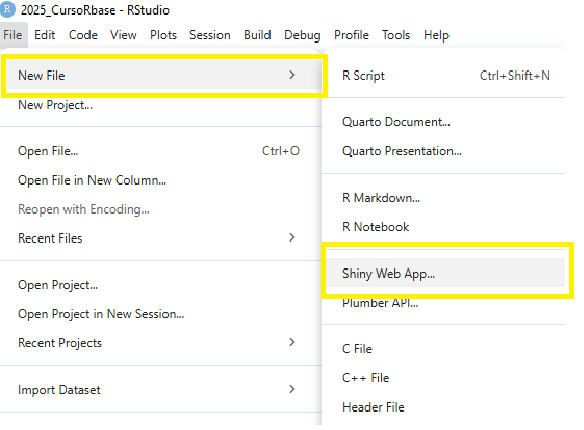
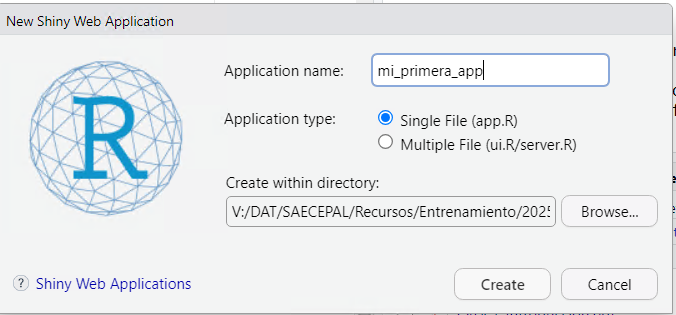

```{r setup, include=FALSE}
# Configuración inicial: No mostrar mensajes ni warnings
knitr::opts_chunk$set(echo = FALSE, message = FALSE, warning = FALSE)
library(printr)
```

# Introducción

En análisis de datos solemos crear gráficos, indicadores y tablas estáticas. Pero muchas
veces la conversación con quienes usan esos resultados exige algo más dinámico:

-   "¿Y qué pasa si cambio el año?"
-   "¿Se podrá ver solo un país?"
-   "¿Me puedes generar un gráfico interactivo?"

Antes, estas preguntas significaban rehacer el código y generar resultados nuevos.

::: callout-note
Shiny permite que cualquier persona explore tus datos sin escribir una sola línea de
código.
:::

# ¿Qué es Shiny?

Shiny es un paquete de R que permite construir aplicaciones web interactivas. No requiere
conocimientos de HTML ni JavaScript (aunque se puede sumar más adelante). Su enfoque es
simple: usar objetos de R para generar elementos visuales que respondan a la interacción
de la persona usuaria.

::: callout-important
Shiny no es un lenguaje nuevo:

Es R, haciendo cosas web.
:::

# ¿Que se necesita instalar?

-   Paquete Shiny

``` yaml
# install.packages("shiny")

library(shiny)
```

# Cómo crear una app Shiny desde cero

En Rstudio:

1.  File → New File → Shiny Web App…



# Cómo crear una app Shiny desde cero

2.  Elige Single File (app.R)

3.  Coloca un nombre, por ejemplo mi_primera_app

4.  Guarda en una carpeta

5.  Se abrirá un archivo app.R con una plantilla inicial



# Anatomía de una app Shiny

**Estructura mínima**

``` yaml
library(shiny)

ui <- fluidPage("Hola Shiny")

server <- function(input, output, session) {}

shinyApp(ui, server)
```

Tres componentes esenciales:

1.  **ui** → cómo se verá la aplicación
2.  **server** → qué hará
3.  **shinyApp()** → la ejecuta

# Profundicemos en el ui

El ui es como "el lienzo" donde colocas elementos visuales:

``` yaml
ui <- fluidPage(
titlePanel("Mi primera app Shiny"),
p("Aquí colocamos el contenido visible.")
)
```

Se puede incluir:

-   Textos

-   Controles (inputs)

-   Salidas (outputs)

-   Gráficos

-   Tablas

# Profundicemos en server

El server define qué hace la aplicación: cálculos, filtrado, reactividad, generación de gráficos o tablas, etc.

En términos teóricos:

- input recibe información desde la interfaz (ej. número elegido en un slider).

- output envía resultados hacia la interfaz (ej. un gráfico).
El servidor define la lógica:

``` yaml
server <- function(input, output, session) 
```

::: callout-important
El server no dibuja nada por sí mismo: solamente produce resultados.
El ui decide dónde se muestran.
:::

# Reactividad: el corazón de Shiny

La reactividad es el mecanismo que hace que Shiny responda automáticamente a los cambios del usuario.

Ejemplo conceptual:

- Si el usuario cambia un año → se recalcula el gráfico

- Si el usuario selecciona un país → se actualiza la tabla

- Si el usuario elige una variable → se redibuja el análisis

Shiny detecta estas conexiones de forma automática.
El desarrollador solo declara qué depende de qué.

# Cómo agregar una imagen en una app Shiny

En Shiny, una imagen se incluye colocando en la interfaz un componente visual que la muestre.

Estructura conceptual:

``` yaml
img(src = "nombre_archivo.png", width = "50%")
```

Para que funcione:

1. La imagen debe guardarse en una carpeta www/ dentro del proyecto.

2. En el ui, se llama a img() indicando el nombre del archivo.

::: callout-tip
Shiny sirve imágenes igual que un servidor web: siempre deben estar dentro de una carpeta www.
:::

# Cómo agregar una tabla en una app Shiny

Una tabla en Shiny se compone de:

1. Un espacio en la interfaz para mostrarla:

``` yaml
tableOutput("mi_tabla")
```
2. Una definición en el server que produce esa tabla:

``` yaml
output$mi_tabla <- renderTable( … )
```

::: {.callout-note title="A nivel conceptual:"}
ui coloca el espacio
server genera el contenido
:::

# Cómo agregar un gráfico

Los gráficos funcionan igual que las tablas:

1. En el ui se reserva el espacio:

``` yaml
plotOutput("grafico1")
```

2. En el server se define cómo se genera:

``` yaml
output$grafico1 <- renderPlot( … )

```

# Construcción del layout: organización visual

Shiny ofrece estructuras listas para organizar contenido:

- fluidPage → página fluida, adaptable

- sidebarLayout → columna izquierda para controles, derecha para resultados

- tabsetPanel → pestañas

- navbarPage → navegación superior

::: {.callout-note title="A nivel conceptual:"}
layout = organización lógica de qué va dónde
:::

# Ejecución 

Una app Shiny se ejecuta:

- Con el botón Run App

- O con:

``` yaml
shiny::runApp()
```
Al ejecutar:

1. Se abre una ventana o navegador

2. La interfaz responde a las acciones del usuario

3. ada cambio provoca reactividad interna

# Cómo compartir una app Shiny

Shiny ofrece varias formas de distribución:

1. shinyapps.io → subir la app a la nube

2. Shiny Server → instalar en un servidor institucional

3. RStudio Connect → despliegue profesional

4. Compartir el proyecto → permite ejecutar localmente

# Resumen de la clase

| Tema                       | Punto clave                                                              |
| -------------------------- | ------------------------------------------------------------------------ |
| **Qué es Shiny**           | Permite crear aplicaciones web interactivas directamente desde R.        |
| **Estructura básica**      | `ui` = interfaz; `server` = lógica; `shinyApp()` = ejecuta.              |
| **Reactividad**            | La app se actualiza automáticamente cuando cambia un input.              |
| **Elementos del ui**       | Textos, imágenes, tablas, gráficos y controles.                          |
| **Cómo agregar contenido** | Imágenes en `www/`; tablas con `tableOutput`; gráficos con `plotOutput`. |
| **Ejecución**              | Botón *Run App* o `shiny::runApp()`.                                     |
| **Publicación**            | shinyapps.io, Shiny Server o compartir el proyecto.                      |

