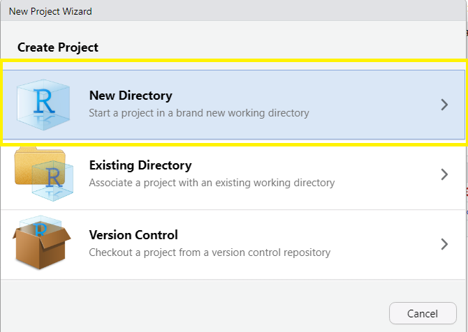
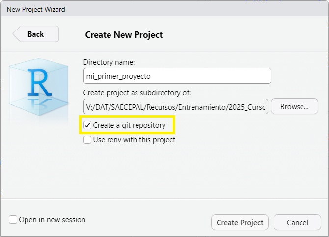
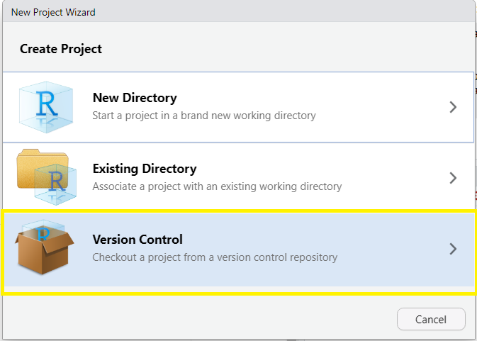
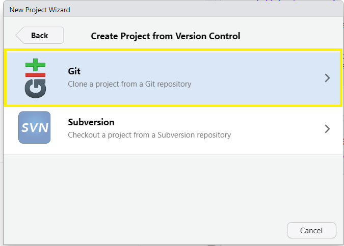
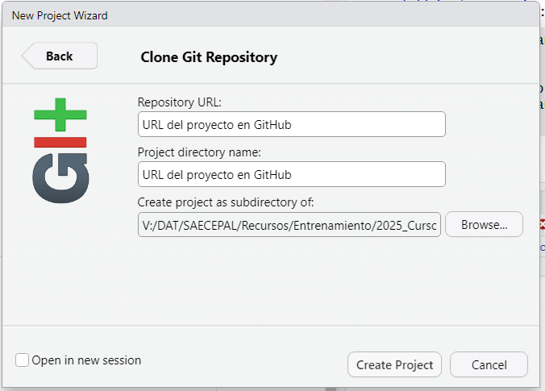

```{r setup, include=FALSE}
# Configuración inicial: No mostrar mensajes ni warnings
knitr::opts_chunk$set(echo = FALSE, message = FALSE, warning = FALSE)
library(printr)
```

# Introducción

En proyectos de análisis de datos —especialmente cuando los archivos cambian día a día— es
muy común perder el control de las versiones:

-   “script_final.R”

-   “script_final_de_verdad.R”

-   “script_final_final.R”

Este caos es más frecuente de lo que quisiéramos. Aquí es donde aparece Git, una
herramienta diseñada para registrar cada cambio, volver atrás cuando sea necesario,
trabajar en equipo y mantener un historial limpio y organizado.

::: callout-note
Git permite rastrear cambios de forma segura y transparente, sin duplicar archivos.
:::

# ¿Qué es Git?

Git es un sistema de control de versiones distribuido. Esto quiere decir que:

-   Cada copia del proyecto contiene su propio historial

-   No dependemos de un servidor central para guardar cambios

-   Cualquier versión pasada puede recuperarse en segundos

Git responde tres grandes necesidades:

1.  Historial: saber qué se cambió y cuándo

2.  Seguridad: poder deshacer cambios sin miedo

3.  Colaboración: varias personas trabajando en el mismo proyecto sin pisarse

# Git vs GitHub: no son lo mismo

| Herramienta | ¿Qué es?                        | ¿Para qué sirve?                                 |
|----------------------|--------------------------|------------------------------------------|
| **Git**     | Sistema de control de versiones | Guarda y gestiona cambios en tu computador       |
| **GitHub**  | Plataforma web basada en Git    | Permite compartir proyectos en línea y colaborar |

También existen alternativas como GitLab y Bitbucket.

# ¿Por qué usar Git en ciencia de datos?

Git ayuda a evitar:

-   Perder código al sobrescribir archivos

-   Conflictos entre personas del equipo

-   Dificultad para reproducir análisis anteriores

-   No recordar qué versión del script generó cierto resultado

# Conceptos fundamentales

Git funciona sobre algunos conceptos clave:

1.  Repositorio: Es la carpeta donde Git guarda el historial del proyecto.

2.  Commit: Representa un “punto en el tiempo”.Cada commit guarda:

    -   Qué cambió
    -   Quién lo cambió
    -   Cuándo
    -   Un mensaje que explica el cambio

# Conceptos fundamentales

3.  Ramas (branches): Líneas paralelas de desarrollo usadas para:

    -   Probar ideas sin afectar la versión principal

    -   Trabajar en nuevas funciones

    -   Revisar cambios antes de integrar al proyecto

4.  Mergue: Operación que combina dos ramas.

5.  Clonación (clone) y sincronización (pull/push): Para trabajar con repositorios remotos
    como GitHub.

# Flujo de trabajo típico con Git

Podemos resumir el uso de Git en tres pasos:

1.  Registrar archivos nuevos o modificados → git add

2.  Guardar un punto en el tiempo → git commit

3.  Enviar cambios a un servidor remoto → git push

En un proyecto colaborativo, también recibimos cambios con:

. git pull

Esto garantiza que el equipo trabaje con la versión más reciente.

``` yaml
add  →  commit  →  push
pull → actualizar desde remoto
```

# Git en RStudio

RStudio incluye una interfaz visual para Git, lo que facilita su uso sin escribir
comandos.

En un proyecto habilitado:

-   Aparece la pestaña Git

-   Podrás ver qué archivos cambiaron

-   Podrás hacer add, commit, pull, push y gestionar ramas

::: callout-important
Para usar Git en RStudio, primero debe estar instalado Git en tu computador.
:::

# Cómo iniciar un repositorio con RStudio

1.  Crear un nuevo proyecto de RStudio

**New Project → New Directory → New Project**

{width=60%}

# Cómo iniciar un repositorio con RStudio

2.  Marcar la casilla Create a Git repository
3.  Darle click en **Create Project**


{width=60%}

# Cómo conectar un proyecto a GitHub

Para publicar un repositorio en GitHub desde RStudio:

1.  Crear el repositorio vacío en GitHub
2.  Copiar la URL
3.  En RStudio:

**New Project → Version Control → Git**

{width=60%}

# Cómo conectar un proyecto a GitHub

3.  En RStudio:

**New Project → Version Control → Git**

{width=60%}

# Cómo conectar un proyecto a GitHub

4.  Agregar la URL como repositorio remoto
5.  Realizar un primer push

Esto permite que tu proyecto local y GitHub queden sincronizados.


{width=60%}

# Buenas prácticas al usar Git

-   Hacer commits pequeños y frecuentes

-   Usar mensajes claros y explicativos

-   Crear ramas para nuevas funciones o análisis

-   No subir datos sensibles ni archivos muy grandes

-   Mantener el repositorio limpio (evitar archivos innecesarios)

# Git para reproducibilidad

El control de versiones facilita:

-   Regresar a una versión exacta del análisis

-   Documentar qué decisiones metodológicas se tomaron y cuándo

-   Comparar modelos o scripts entre versiones

-   Replicar informes o estudios tiempo después


# Resumen de la clase

| Tema             | Punto clave                                              |
| ---------------- | -------------------------------------------------------- |
| ¿Qué es Git?     | Sistema que registra y gestiona cambios en proyectos.    |
| Git vs GitHub    | Herramienta local vs plataforma colaborativa en la nube. |
| Conceptos clave  | Repositorio, commit, ramas, merge, push/pull.            |
| RStudio + Git    | Interfaz gráfica para trabajar sin comandos.             |
| Buenas prácticas | Commits claros, ramas, evitar datos sensibles.           |

