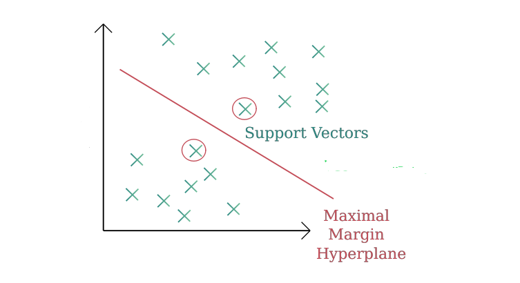

```{r setup, include=FALSE}
# Configuración inicial: No mostrar mensajes ni warnings
knitr::opts_chunk$set(echo = FALSE, message = FALSE, warning = FALSE)
library(printr)
```

# Introducción

Las SVM (Support Vector Machines) son modelos de **clasificación supervisada** diseñados para encontrar la frontera que mejor separa dos clases en el espacio de características.

::: {.callout-tip title="Idea central"}
Una SVM busca un hiperplano que separa las clases con el **mayor margen posible**.  
Los puntos que efectivamente determinan esa frontera se llaman **vectores de soporte**.
:::

# Support Vector Machines

En la figura se observa cómo una SVM separa dos clases mediante un hiperplano de margen máximo, definido únicamente por los puntos más cercanos a la frontera, llamados vectores de soporte.


# Vectores de soporte

Solo unos pocos puntos realmente importan para determinar
la frontera óptima.

::: {.callout-tip title="¿Quiénes importan?"}
Los puntos *más cercanos* a la frontera son los que la
definen. Esos son los **vectores de soporte**. 
:::

Estos son los únicos puntos que influyen en la frontera final.

# ¿Y si no somos capaces de separar linealmente?

Hay situaciones donde ninguna línea puede separar rectamente a las clases.

::: {.callout-note title="Problema real"}
Las SVM superan este problema transformando el espacio de características
de modo que las clases sí sean separables allí.
:::


# Hiperplanos: ¿qué son?

En un espacio de características:
- un **hiperplano** es una frontera que divide dos clases.
  
Si $(p=2)$, es una **línea**.  
Si $(p=3)$, es un **plano**.  
Y para $(p=3)$,, es un plano en dimensiones superiores. 

::: {.callout-note title="Intuición geométrica"}
Un hiperplano divide el espacio en dos regiones:  
una para cada clase. No importa la dimensión, ¡la idea es la misma!
:::


# ¿Cuál hiperplano es “el mejor”?

En muchas situaciones **hay infinitas maneras** de separar dos grupos.  
Entonces la pregunta es:

::: {.callout-tip title="¿Cuál frontera elegir?"}
De todas las posibles fronteras que separan las clases,
¿cuál es la que mejor generaliza a datos nuevos? 
:::

La SVM responde:

> El que deja el **mayor espacio (o margen) posible** entre las clases. 


# Margen óptimo

El **margen** es la distancia entre la frontera y los
puntos más cercanos de cada clase.

::: {.callout-tip title="Interpretación central"}
Maximizar el margen produce fronteras más estables y generalizables.
:::

Dos conceptos clave:

- **Márgenes grandes** → región clara entre clases  
- **Márgenes pequeños** → modelo frágil  


# ¿Por qué no basta separar bien?

Imagina una frontera que clasifica perfecto en los datos que ves,
pero está **muy cerca de los puntos**.

::: {.callout-warning title="Sobreajuste sin margen"}
Aunque la separación en los datos de entrenamiento sea perfecta,
esa frontera podría fallar con nuevos datos.
:::


# El **kernel trick**

El truco es usar funciones llamadas **kernels** para implicar el cálculo
de productos internos en espacios transformados sin construirlos explícitamente. 

Es decir:

::: {.callout-tip title="Kernel trick"}
En vez de encontrar una frontera compleja en el espacio original,
buscamos una frontera **simple en un espacio transformado**.
:::


# Kernels comunes

Estos son los más utilizados:

- **Lineal**  
  Mide similitud simple $(x_i^\top x_j)$.

- **Polinómico**  
  $((\gamma x_i^\top x_j + r)^d)$. 

- **RBF / Radial**  
  $(\exp(-\gamma\|x_i-x_j\|^2))$. 

::: {.callout-tip title="Kernel RBF"}
Este es el más usado porque permite fronteras **suaves y no lineales**  
sin que el modelo se vuelva inestable.
:::

# Historia: El equipo que quería distinguir minas de rocas

Un equipo de investigación marina trabajaba con dispositivos de sonar para detectar minas submarinas en zonas de navegación.
El sonar emitía pulsos de sonido y registraba el eco devuelto por objetos en el fondo marino.

Cada eco podía ser:

- Una roca inofensiva (R), o

- Una mina (M) que representaba un riesgo real.

# Historia: El equipo que quería distinguir minas de rocas

Los ingenieros habían logrado registrar, para cada eco de sonar:

- La energía reflejada en distintas bandas de frecuencia.

- Un rótulo final asignado por expertos: M (mina) o R (roca).

Sin embargo, al graficar algunos pares de variables, notaban que:

- En algunos casos, las minas y rocas se mezclaban.

- No era posible separarlas con una simple línea recta.

::: {.callout-warning title="Pregunta problema"}
“¿Podemos construir un modelo que distinga minas de rocas, incluso cuando la frontera de separación es compleja?”
:::

Los ingenieron decidieron entonces aplicar **Máquinas de Soporte Vectorial**.

# Datos: Sonar (mlbench)

```{r include=TRUE, echo=TRUE}
library(mlbench)
data(Sonar)
head(Sonar[1:8],5)

```
# Preparación de los datos

Al contrastar la metodología para Máquinas de Soporte Vectorial, los ingenieros concluyeron que **el primer paso imprescindible era estandarizar las covariables**. 

```{r include=TRUE, echo=TRUE}
X <- as.data.frame(scale(Sonar[, 1:60]))  # predictores estandarizados
y <- Sonar$Class                          # clase: M / R

datos <- cbind(X, Class = y)
round(head(datos[, 1:8]),3)


```

# Visualización preliminar (PCA)

El equipo decidió empezar con una SVM lineal, para observar qué tan separables eran las clases en el espacio original.

```{r include=TRUE, echo=FALSE,  fig.height=5, out.width='80%'}
library(ggplot2)
pca <- prcomp(X, scale. = FALSE)
df_pca <- data.frame(PC1 = pca$x[,1],
PC2 = pca$x[,2],
Class = y)

ggplot(df_pca, aes(PC1, PC2, color = Class)) +
geom_point(alpha = 0.7) +
theme_minimal() +
ggtitle("Sonar: proyección PCA (2 componentes)")


```

# Visualización preliminar (PCA)

::: {.callout-note title="¿Qué observaron los analistas en la PCA?"}
Las observaciones correspondientes a minas y rocas no se separan de forma perfectamente lineal en el plano PCA. Hay zonas de mezcla entre clases, lo que sugiere la necesidad de un clasificador con fronteras no lineales, como una SVM con kernel radial.
:::

# SVM con kernel radial (RBF)

```{r include=TRUE, echo=TRUE}
library(e1071)
svm_rbf <- svm(Class ~ ., data = datos,
kernel = "radial",
cost   = 10,
gamma  = 0.05)

svm_rbf


```
# SVM con kernel radial (RBF)

```{r include=TRUE, echo=TRUE}
pred_rbf <- predict(svm_rbf, datos)
tab_rbf  <- table(Predicho = pred_rbf, Real = datos$Class)
tab_rbf

acc_rbf <- sum(diag(tab_rbf)) / sum(tab_rbf)
acc_rbf

```
# SVM con kernel radial (RBF)
::: {.callout-note title="¿Qué observaron los analistas al evaluar el modelo RBF?"}

Al revisar los resultados del modelo SVM con kernel radial, los analistas notaron un desempeño excepcional: la matriz de confusión mostró que todas las minas fueron correctamente clasificadas como minas y todas las rocas como rocas, sin errores de predicción. Esto se reflejó en una precisión igual a 1, es decir, una clasificación perfecta en el conjunto de entrenamiento.
:::

# Vectores de soporte

```{r include=TRUE, echo=TRUE}
svm_rbf$nSV

```
::: {.callout-note title="¿Qué observaron los analistas sobre los vectores de soporte?"}

Al revisar el objeto del modelo, los analistas notaron que la SVM con kernel radial utilizaba **89 vectores de soporte de una clase y 100 de la otra**, es decir, casi todas las observaciones del conjunto de datos participaban en la definición de la frontera de decisión. 
:::


# Resumen de la clase

| Tema                  | Idea principal                                | Herramienta |
|---------------------- |-----------------------------------------------|-------------|
| SVM                  | Modelo para clasificar o predecir valores      | `svm()`     |
| Margen               | SVM busca la separación más amplia entre clases| —           |
| Vectores de soporte  | Puntos que definen la frontera                 | —           |
| Kernel radial (RBF)  | Permite fronteras curvas                       | `kernel="radial"` |
| Regresión SVM        | Predice ingreso y se evalúa con RMSE           | RMSE        |
| Clasificación SVM    | Predice pobreza (0/1) con umbral 0.5           | `if_else()` |
| Evaluación           | Calidad del modelo via matriz de confusión     | `table()`, `mean()` |
  |
